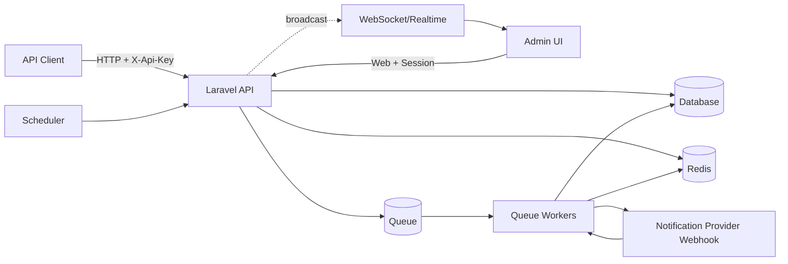
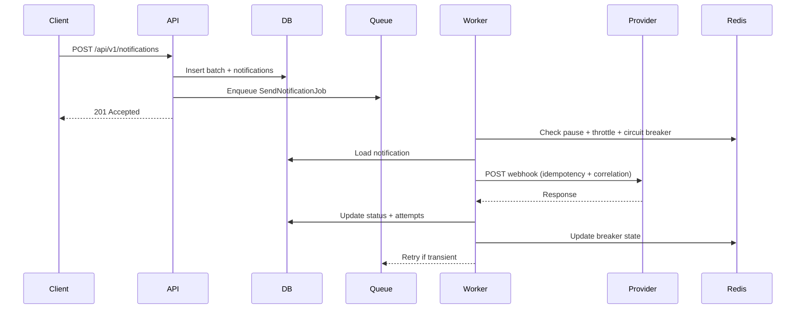
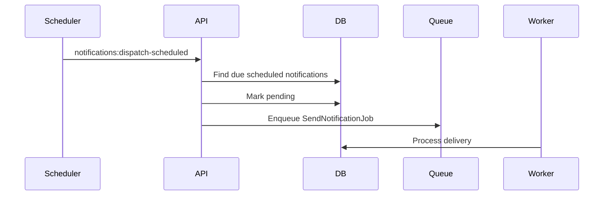

# Architecture

## Overview
This project is a Laravel 12 notification platform that accepts API requests, persists notification data, and delivers messages asynchronously through a webhook-based provider. It supports batch creation, scheduling, retries, rate limiting, circuit breaking, templating, and real-time status updates.

## Technology Stack
- **Backend**: Laravel 12 (PHP)
- **Database**: MySQL (or SQLite for local/testing)
- **Cache/Queue**: Redis
- **Queue Processing**: Laravel queues (database/redis driver)
- **Realtime**: WebSocket broadcasting (Laravel broadcasting)
- **Containerization**: Docker + Docker Compose

Key runtime dependencies:
- **Database**: stores notifications, batches, attempts, templates, admin users, and settings.
- **Redis**: used for throttling, circuit breaker state, pause flags, and admin stress test state.
- **Queue worker(s)**: process delivery jobs per priority queue.
- **Scheduler**: dispatches scheduled notifications every minute.
- **HTTP provider**: webhook endpoint (with optional fallback) that performs the actual delivery.

## Architectural Design

```
┌─────────────────────────────────────────────────────────────────────────────┐
│                                 API Layer                                   │
│  ┌───────────────┐  ┌───────────────┐  ┌───────────────┐  ┌───────────────┐ │
│  │ Notification  │  │   Template    │  │    Metrics    │  │    Health     │ │
│  │  Controller   │  │  Controller   │  │  Controller   │  │  Controller   │ │
│  └──────┬────────┘  └──────┬────────┘  └──────┬────────┘  └───────────────┘ │
└─────────┼──────────────────┼──────────────────┼────────────────────────────┘
          │                  │                  │
          ▼                  ▼                  ▼
┌─────────────────────────────────────────────────────────────────────────────┐
│                               Service Layer                                 │
│  ┌────────────────────┐  ┌──────────────────┐  ┌───────────────────────┐   │
│  │ NotificationProvider│  │  RetryPolicy     │  │   CircuitBreaker      │   │
│  │                    │  │                  │  │                       │   │
│  └─────────┬──────────┘  └─────────┬────────┘  └─────────┬─────────────┘   │
└────────────┼──────────────────────┼──────────────────────┼─────────────────┘
             │                      │                      │
             ▼                      ▼                      ▼
┌─────────────────────────────────────────────────────────────────────────────┐
│                         Queue Layer (Redis/DB)                               │
│  ┌──────────────────┐  ┌──────────────────┐  ┌──────────────────┐          │
│  │notifications-high│  │notifications-norm│  │notifications-low │          │
│  └────────┬─────────┘  └────────┬─────────┘  └────────┬─────────┘          │
└───────────┼─────────────────────┼─────────────────────┼────────────────────┘
            │                     │                     │
            └─────────────────────┼─────────────────────┘
                                  ▼
┌─────────────────────────────────────────────────────────────────────────────┐
│                            Processing Layer                                  │
│  ┌───────────────────────────────────────────────────────────────────────┐ │
│  │                         SendNotificationJob                            │ │
│  │  ┌──────────────┐  ┌───────────────┐  ┌───────────────────────────┐    │ │
│  │  │Rate Limit +  │─▶│  Provider     │─▶│ NotificationAttempt Log   │    │ │
│  │  │Circuit Breaker│  │  Webhook     │  │  (Correlation/Trace ID)   │    │ │
│  │  └──────────────┘  └───────────────┘  └───────────────────────────┘    │ │
│  └───────────────────────────────────────────────────────────────────────┘ │
└─────────────────────────────────────────────────────────────────────────────┘
                                  │
                                  ▼
┌─────────────────────────────────────────────────────────────────────────────┐
│                           External Provider                                  │
└─────────────────────────────────────────────────────────────────────────────┘

┌─────────────────────────────────────────────────────────────────────────────┐
│                              Admin & Scheduler                               │
│  ┌──────────────────────┐           ┌─────────────────────────────────────┐ │
│  │     Admin UI          │           │        Scheduler (cron)             │ │
│  │  /admin/* routes      │           │  notifications:dispatch-scheduled   │ │
│  └──────────┬───────────┘           └───────────────┬─────────────────────┘ │
│             │                                      │                       │
│             ▼                                      ▼                       │
│  ┌───────────────────────────┐          ┌───────────────────────────────┐ │
│  │ Worker Control (Supervisor)│          │ Dispatch due notifications    │ │
│  └───────────────────────────┘          └───────────────────────────────┘ │
└─────────────────────────────────────────────────────────────────────────────┘
```

### Layered Architecture
This system uses a layered architecture to separate concerns and keep the codebase maintainable:
- **Presentation layer**: HTTP controllers, routes, middleware, and admin UI views.
- **Application layer**: orchestration logic (jobs, commands, observers) that coordinates workflows.
- **Domain layer**: core models and services (notifications, templates, retry logic, circuit breaker).
- **Infrastructure layer**: database, Redis, queues, HTTP provider integrations, and scheduler.

Representative locations:
- Presentation: `app/app/Http`, `app/routes`, `app/resources/views`
- Application: `app/app/Jobs`, `app/app/Console`, `app/app/Observers`
- Domain: `app/app/Models`, `app/app/Services`, `app/app/Events`
- Infrastructure: `app/config`, `app/database`, `app/docker`, `app/docker-compose.yml`

## High-Level Flow
1. **Client submits request** to `POST /api/v1/notifications` (API key + rate limiting enforced).
2. **Controller validates + stores** Notification + optional Batch. Content can be rendered from templates.
3. **Jobs dispatched** to priority queues (high/normal/low) for immediate delivery.
4. **Queue workers** process `SendNotificationJob`:
   - Check pause flag, scheduled time, TTL expiration.
   - Apply per-channel rate limiting and circuit breaker.
   - Call the provider webhook with correlation + idempotency headers.
   - Persist attempts and update notification status.
5. **Retries or dead-letter**
   - Transient failures are retried with exponential backoff + jitter.
   - Permanent failures or max attempts go to dead-letter storage.
6. **Status updates** broadcast over WebSockets when status changes.

## Diagrams

### System Context


### Send Notification (Immediate)


### Scheduled Dispatch


## Core Components
- **API layer**: `app/Http/Controllers/*` + `routes/api.php`
  - Notification, batch, template, health, metrics, and dead-letter endpoints.
- **Admin UI**: `routes/web.php`, `resources/views/*`, `Admin*Controller`
  - Login, worker control (Supervisor), provider settings, stress tests, analytics.
- **Delivery pipeline**: `SendNotificationJob`, `NotificationProvider`, `RetryPolicy`, `ErrorClassifier`, `CircuitBreaker`.
- **Scheduling**: `notifications:dispatch-scheduled` command in `DispatchScheduledNotifications` run by scheduler.
- **Observability**: metrics endpoints, health checks, logs with correlation/trace IDs.

### Services (Responsibilities)
- **NotificationProvider**: Sends the outbound webhook to the provider (with idempotency + correlation headers) and handles fallback webhook logic.
- **NotificationSettings**: Persists runtime-configurable settings (provider URLs) in DB with a short Redis cache.
- **RetryPolicy**: Calculates exponential backoff delays and circuit-breaker open delay.
- **CircuitBreaker**: Tracks per-channel failures in Redis and opens/closes the breaker to pause sends.
- **ErrorClassifier**: Maps HTTP/connection errors into `transient` vs `permanent` error types + codes.
- **TemplateRenderer**: Performs simple token substitution (e.g., `{{name}}`) to render template content.

### Middleware (Responsibilities)
- **ApiKeyAuth**: Validates `X-Api-Key` against `API_KEYS` env and rejects unauthorized requests.
- **ClientRateLimit**: Enforces per‑client rate limits using Redis counters.
- **CorrelationIdMiddleware**: Ensures each request has an `X-Correlation-Id` and echoes it in responses/logs.
- **TraceContextMiddleware**: Parses or generates W3C `traceparent` values for tracing headers/logs.
- **AdminBasicAuth**: Basic auth protection for admin endpoints (if enabled).
- **AdminSessionAuth**: Session-based auth guard for admin UI routes.

### Jobs (Responsibilities)
- **SendNotificationJob**: Applies pause/TTL/limit checks, sends to provider, retries on transient errors, and records attempts.
- **DeadLetterNotificationJob**: Persists permanently failed notifications into the dead-letter table.
- **RequeueDeadLetterNotifications (command)**: Recreates a notification from dead-letter data and enqueues it for retry.

### Dead-Letter Recovery
- **Single requeue**: `POST /api/v1/dead-letter/{deadLetterId}/requeue` recreates one notification.
- **Bulk requeue**: `POST /api/v1/dead-letter/requeue` requeues up to `limit` (default 100), optionally filtered by `channel`.

## Data Model (Primary Tables)
- **notifications**: core record with status, channel, content, scheduling, retries.
- **notification_batches**: groups requests, tracks batch-level status.
- **notification_attempts**: per-send attempt history.
- **dead_letter_notifications**: permanent failures snapshot.
- **notification_templates**: reusable content + default variables.
- **notification_settings**: dynamic provider config (editable via admin UI).
- **admin_users**: admin panel auth.

## Database Schemas (Summary)
The project uses UUIDs for domain tables unless noted otherwise.

### notification_batches
- `id` (uuid, pk)
- `idempotency_key` (string, unique, nullable)
- `correlation_id` (string, indexed, nullable)
- `trace_id` / `span_id` (string, nullable)
- `status` (string, indexed, default: pending)
- `total_count` (unsigned int)
- `metadata` (json, nullable)
- `created_at` / `updated_at`

### notifications
- `id` (uuid, pk)
- `batch_id` (uuid, fk -> notification_batches.id, nullable, indexed)
- `channel` (string, indexed)
- `priority` (string, indexed, default: normal)
- `recipient` (string, indexed)
- `content` (text)
- `status` (string, indexed, default: pending)
- `idempotency_key` (string, unique, nullable)
- `correlation_id` (string, indexed, nullable)
- `trace_id` / `span_id` (string, nullable)
- `attempts` (unsigned tiny int, default: 0)
- `max_attempts` (unsigned tiny int, default: 5)
- `scheduled_at` (timestamp, indexed, nullable)
- `processing_started_at` (timestamp, nullable)
- `sent_at` (timestamp, indexed, nullable)
- `cancelled_at` (timestamp, nullable)
- `provider_message_id` (string, indexed, nullable)
- `provider_response` (json, nullable)
- `last_error` (text, nullable)
- `error_type` / `error_code` (string, nullable)
- `last_retry_at` / `next_retry_at` (timestamp, nullable)
- `created_at` / `updated_at`

### notification_attempts
- `id` (uuid, pk)
- `notification_id` (uuid, fk -> notifications.id, indexed)
- `attempt_number` (unsigned tiny int)
- `status` (string)
- `request_payload` / `response_payload` (json, nullable)
- `error_message` (text, nullable)
- `error_type` / `error_code` (string, nullable)
- `http_status` (unsigned small int, nullable)
- `duration_ms` (unsigned int, nullable)
- `created_at` / `updated_at`

### dead_letter_notifications
- `id` (uuid, pk)
- `notification_id` (uuid, nullable, indexed)
- `channel` (string, nullable, indexed)
- `recipient` (string, nullable, indexed)
- `attempts` (unsigned tiny int, default: 0)
- `error_type` / `error_code` (string, nullable)
- `error_message` (text, nullable)
- `payload` / `last_response` (json, nullable)
- `created_at` / `updated_at`

### notification_templates
- `id` (uuid, pk)
- `name` (string, unique)
- `channel` (string, indexed)
- `content` (text)
- `default_variables` (json, nullable)
- `created_at` / `updated_at`

### notification_settings
- `id` (bigint, pk)
- `name` (string, unique)
- `value` (text, nullable)
- `created_at` / `updated_at`

### admin_users
- `id` (uuid, pk)
- `name` (string)
- `email` (string, unique)
- `password` (string)
- `role` (string, default: admin)
- `is_active` (boolean, default: true)
- `last_login_at` (timestamp, nullable)
- `created_at` / `updated_at`

### Framework Tables

#### users
- `id` (bigint, pk)
- `name` (string)
- `email` (string, unique)
- `email_verified_at` (timestamp, nullable)
- `password` (string)
- `remember_token` (string, nullable)
- `created_at` / `updated_at`

#### password_reset_tokens
- `email` (string, pk)
- `token` (string)
- `created_at` (timestamp, nullable)

#### sessions
- `id` (string, pk)
- `user_id` (bigint, nullable, indexed)
- `ip_address` (string, nullable)
- `user_agent` (text, nullable)
- `payload` (longtext)
- `last_activity` (int, indexed)

#### cache
- `key` (string, pk)
- `value` (mediumtext)
- `expiration` (int, indexed)

#### cache_locks
- `key` (string, pk)
- `owner` (string)
- `expiration` (int, indexed)

#### jobs
- `id` (bigint, pk)
- `queue` (string, indexed)
- `payload` (longtext)
- `attempts` (unsigned tiny int)
- `reserved_at` (unsigned int, nullable)
- `available_at` (unsigned int)
- `created_at` (unsigned int)

#### job_batches
- `id` (string, pk)
- `name` (string)
- `total_jobs` (int)
- `pending_jobs` (int)
- `failed_jobs` (int)
- `failed_job_ids` (longtext)
- `options` (mediumtext, nullable)
- `cancelled_at` (int, nullable)
- `created_at` (int)
- `finished_at` (int, nullable)

#### failed_jobs
- `id` (bigint, pk)
- `uuid` (string, unique)
- `connection` (text)
- `queue` (text)
- `payload` (longtext)
- `exception` (longtext)
- `failed_at` (timestamp, default: current)

## Status Lifecycle
Common statuses for `notifications`:
- `pending` -> `processing` -> `sent`
- `pending`/`processing` -> `retrying` -> `processing` -> `sent`
- `pending`/`processing` -> `failed` (permanent or max attempts)
- `scheduled` -> `pending` (when due)
- `pending`/`scheduled` -> `cancelled`

Batch status is recomputed by `NotificationObserver` as notification statuses change.

## Reliability & Control
- **Idempotency**: optional idempotency key on batches and notifications.
- **Rate limiting**:
  - per-client (API key) via Redis counter
  - per-channel throttling via Redis `throttle`.
- **Circuit breaker** per channel using Redis keys.
- **Pause processing**: Admin UI sets `notifications:processing:paused` to stop workers and scheduler dispatch.
- **Retry policy**: exponential backoff + jitter; TTL expiration before delivery.

## Real-Time Updates
- Status changes trigger `NotificationStatusUpdated` broadcast on the `notifications` channel.
- Used by WebSocket demo and admin UI for live status.

## Configuration
- `config/notifications.php` controls channels, rate limits, retries, queues, circuit breaker, provider settings.
- `.env` values override config (e.g. `NOTIFICATION_*`, `API_KEYS`).
- Provider URLs can be updated at runtime via admin settings (stored in `notification_settings`).

## Deployment Notes
- Docker Compose setup in `docker-compose.yml` includes app + dependencies.
- Workers run per queue (high/normal/low/dead) and can be managed by Supervisor in the container.
- Scheduler runs `php artisan schedule:work` to dispatch scheduled notifications.

## Key Directories
- `app/app/Http`: controllers, middleware, requests.
- `app/app/Jobs`: queue jobs for delivery and dead-lettering.
- `app/app/Services`: provider, retry, circuit breaker, templates.
- `app/app/Models`: Eloquent models for all domain data.
- `app/routes`: HTTP and console routing.
- `app/database/migrations`: schema definitions.
- `app/resources/views`: admin UI and docs views.
- `app/docs/openapi.yaml`: API spec.
